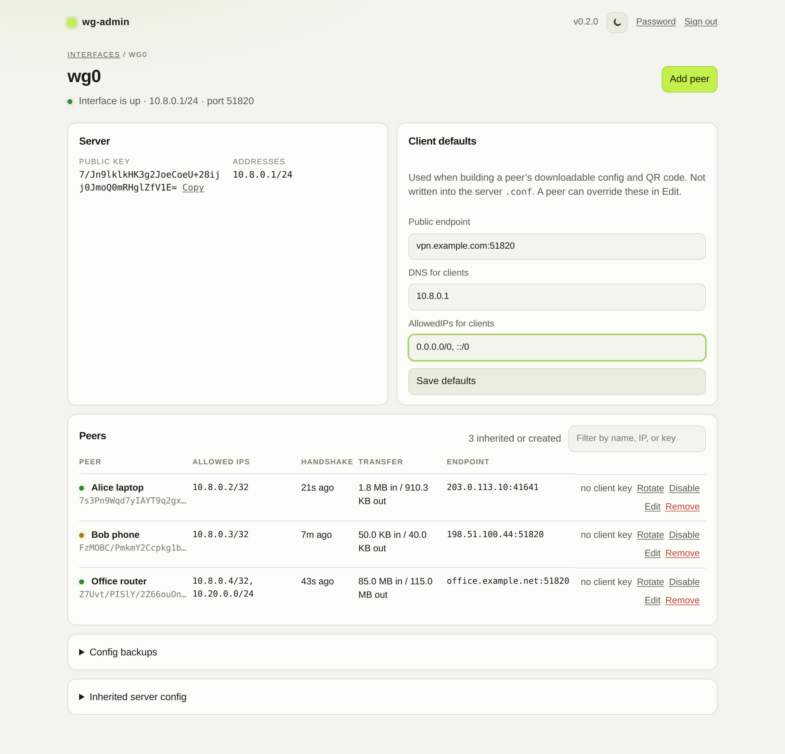

# wg-admin

A focused web UI for a WireGuard host that is already running. It reads the files already in `/etc/wireguard`, lets you add and edit peers, and applies changes with `wg syncconf` so the interface does not bounce.

wg-admin does not install WireGuard, replace `wg-quick`, or rewrite your `PostUp` / NAT lines. It sits on top of the configuration you already have.



[More screenshots](docs/SCREENSHOTS.md)

## Why it exists

Most WireGuard admin panels want to own the tunnel: they generate a new config, take over `wg-quick`, and leave you to re-learn their layout. This one does the opposite.

Install it on a host that already has a working VPN. Existing `[Interface]` keys, routing hooks, and peers stay as they are. You get a password-protected UI for day-to-day peer work — names, client files, QR codes, handshakes — without replacing the server setup you already trust.

## Features

- **Inherits live configs** — every `*.conf` in `/etc/wireguard` is listed and managed in place
- **Non-disruptive apply** — writes the file, then `wg syncconf` when the interface is up (no bounce)
- **Peer lifecycle** — add, rename, edit, disable without deleting, rotate keys, and remove peers
- **Existing public keys** — paste a key from a client that already has one, instead of generating a new pair
- **Client onboarding** — downloadable `.conf` and QR code right after create or rotate; per-peer DNS / AllowedIPs / endpoint overrides
- **Live status** — last handshake, transfer, and endpoint from `wg`, with search and sort
- **Restore backups** — a copy is stored under `/var/lib/wg-admin/backups/` before each write; restore from the UI
- **Local by default** — binds to `127.0.0.1`; put Caddy or nginx with TLS in front if others need access

## Requirements

- Linux with Python 3.11 or newer
- `wireguard-tools` (`wg`) for live status and apply
- Root, or equivalent access to `/etc/wireguard` and `CAP_NET_ADMIN`


## Install

On a host that already runs WireGuard:

```bash
git clone https://github.com/logimaxx/wg-admin.git
cd wg-admin
sudo ./install.sh
```

Then open `http://127.0.0.1:8080` and set an admin password. Every `*.conf` already in `/etc/wireguard` is listed and managed in place.

To remove the service (WireGuard configs are left untouched):

```bash
sudo ./uninstall.sh
```


## Configuration

Defaults live in `/etc/wg-admin.env`:

```
WG_ADMIN_HOST=127.0.0.1
WG_ADMIN_PORT=8080
WG_ADMIN_CONFIG_DIR=/etc/wireguard
WG_ADMIN_STATE_DIR=/var/lib/wg-admin
```

Keep the service on localhost. Put a reverse proxy with TLS in front if anyone else needs access.

## What it inherits


| From the server `.conf`                                                                                     | Kept as-is               |
| ----------------------------------------------------------------------------------------------------------- | ------------------------ |
| `[Interface]` keys (`Address`, `ListenPort`, `PrivateKey`, `PostUp` / `PostDown`, `MTU`, `Table`, `DNS`, …) | Yes                      |
| Existing `[Peer]` public keys, AllowedIPs, PSK, keepalive, endpoint                                         | Yes                      |
| Comment above a peer (`# Alice` or `# Name = Alice`)                                                        | Used as the display name |


WireGuard never stores a client private key on the server. Peers that already existed can be edited and removed, but a downloadable `.conf` / QR code is only available for peers created (or rotated) in this UI.

Client-only settings (public endpoint, DNS, client AllowedIPs) live in `/var/lib/wg-admin/state.json`, not in the server config. A peer can override those defaults without changing the interface.

Disabled peers are commented out in the server file (`# wg-admin:disabled`) so `wg-quick` and `wg syncconf` skip them. Their addresses stay reserved.

## Daily use

- Open an interface to see peers, last handshake, and transfer. Filter or sort the list when it grows.
- **Add peer** generates keys (or takes an existing public key), picks the next free IPv4, and writes the server file. The QR / `.conf` opens immediately when the private key is stored here.
- **Disable** a peer to drop it from the live interface without deleting the block. Restore a backup if a write needs undoing.
- Save / apply uses `wg syncconf` when the interface is up. If it is down, only the file is updated. Change the admin password from **Password** in the header.


## Develop / demo

```bash
python3 -m venv .venv
source .venv/bin/activate
pip install -e '.[dev]'
pytest
./scripts/run-demo.sh
```

Demo mode uses `demo/wireguard` and never calls `wg`.

## Author & company

wg-admin is developed and maintained by **Sergiu Voicu**, co-founder of [LogiMaxx Systems](https://logimaxx.ro) — an IT services firm focused on monitoring, operational automation, and production software.


|            |                                                                      |
| ---------- | -------------------------------------------------------------------- |
| Author     | [Sergiu Voicu](https://github.com/vsergiu)                           |
| Company    | [LogiMaxx Systems](https://logimaxx.ro)                              |
| Repository | [github.com/logimaxx/wg-admin](https://github.com/logimaxx/wg-admin) |
| Contact    | [sergiu@logimaxx.ro](mailto:sergiu@logimaxx.ro)                    |


Issues and pull requests are welcome on GitHub.

## License

MIT. See [LICENSE](LICENSE).

Copyright © 2026 [LogiMaxx Systems](https://logimaxx.ro) and [Sergiu Voicu](https://github.com/vsergiu).

WireGuard is a registered trademark of Jason A. Donenfeld. This project is not affiliated with the WireGuard project.