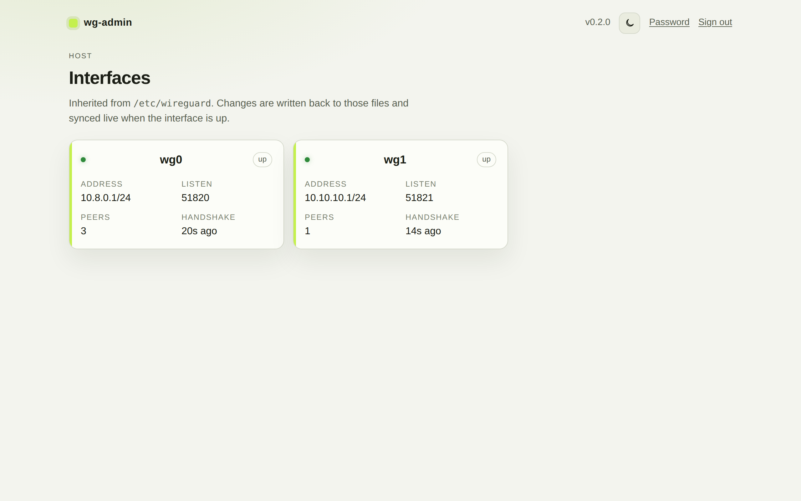
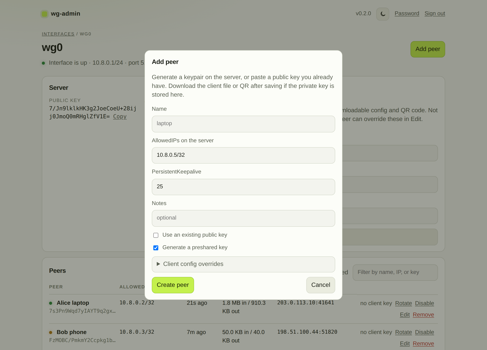
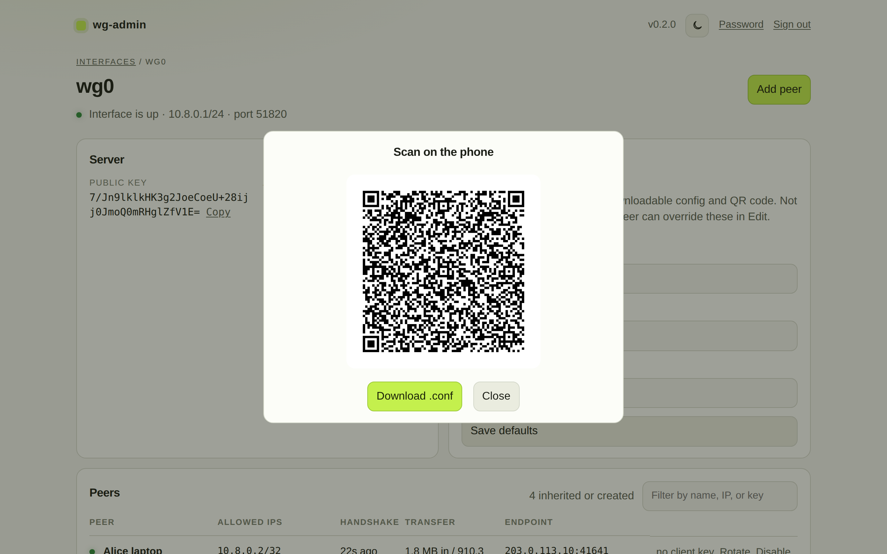
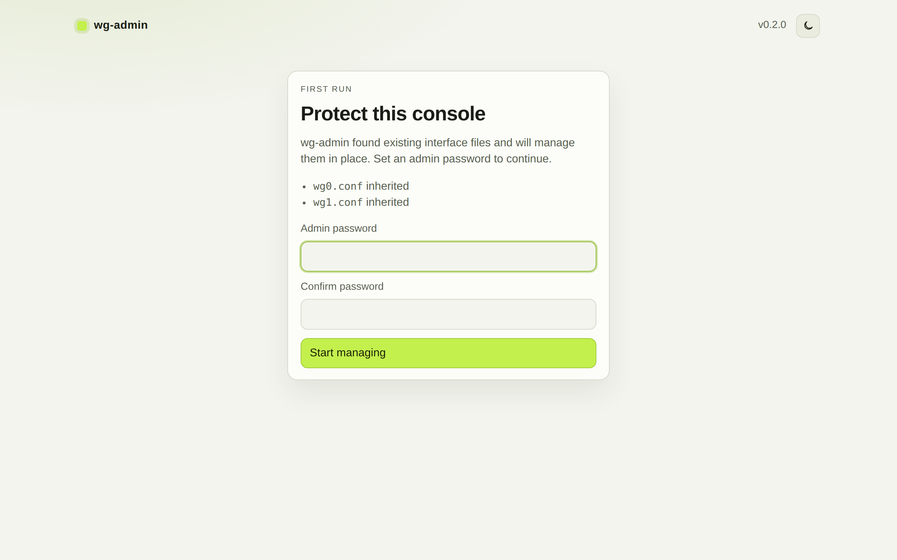

# Screenshots

wg-admin managing interfaces already present in `/etc/wireguard`.

## Interfaces

Every `*.conf` on the host is listed in place. Status comes from `wg` when the interface is up.

## Peers

Open an interface to see peers, last handshake, and transfer. Filter or sort the list. Disable a peer to keep it in the file without leaving it live.

## Add a peer

Generate a keypair on the server, or paste a public key the client already has. The next free IPv4 in the interface subnet is suggested automatically. After create, the QR and `.conf` open when the private key is stored here.

## Client QR

Peers created or rotated in the UI get a downloadable `.conf` and a QR code. Imported peers keep working; they just have no private key on the server.

## First run

On install, existing interface files are inherited. Set an admin password before the console is usable.

Back to the [README](../README.md).
